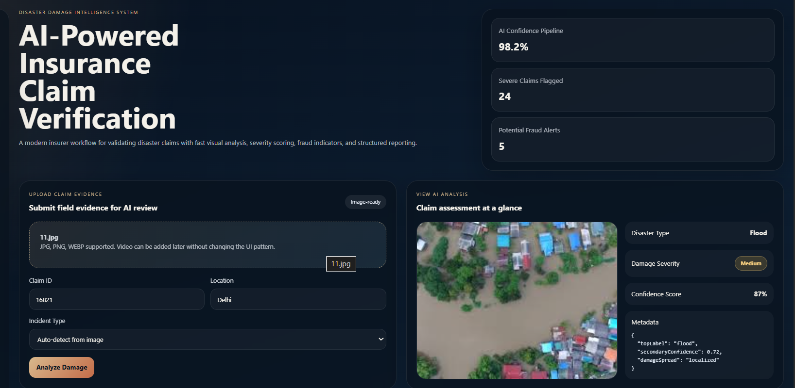
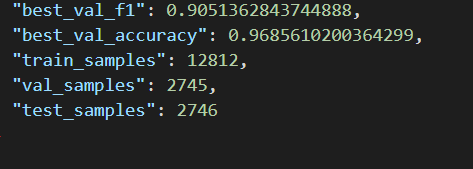
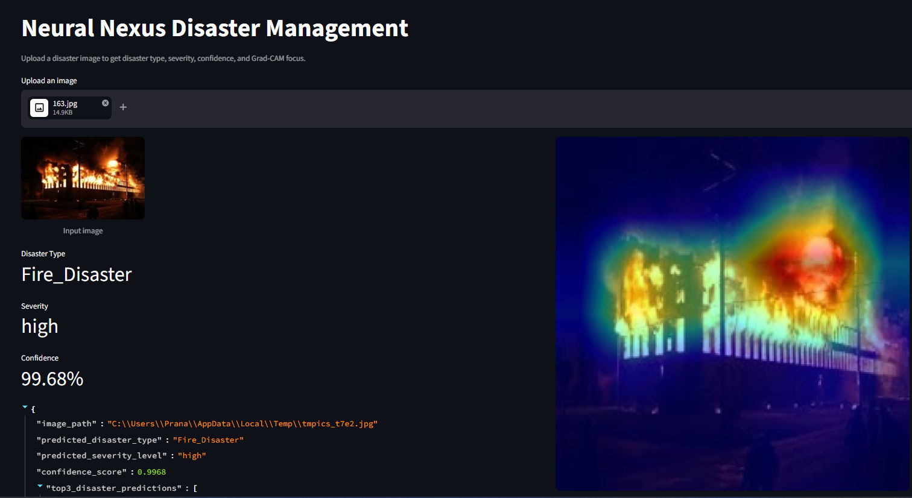

PPT LINK - https://drive.google.com/drive/folders/1qRe3THwM_Gjy4zWN1MaCmIDf16aOZKjc

# Team Igniters – Disaster Classification System

##  Results

-  **Validation Accuracy:** 89.85%  
- **Validation F1 Score:** 81.5  

-  **Test Accuracy:** 90.65%  
-  **Macro F1 Score:** 0.795  
-  **Weighted F1 Score:** 0.890  

---

Before training, we focused on understanding the dataset:

- Data is **imbalanced** (Non_Damage dominates)  
- Some classes look **very similar**  
- Severity levels are **not always visually clear**  
- Images vary in quality, lighting, and angles  

### What we did

- Resized and normalized all images  
- Applied augmentations (flip, rotation, color changes)  
- Used **class weights** to handle imbalance  
- Created proper train / validation / test splits  
- Used efficient DataLoaders  
